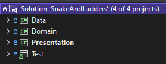
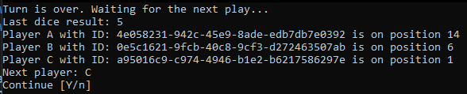

## Snakes and Ladders Kata

Snakes and Ladders is a board game involving two or more players rolling dice in order to move their tokens across a board. The board is made up of a collection of numbered squares and is adorned with 'snakes' and 'ladders', which link two squares on the board- snakes link the squares downwards whilst ladders link them going upwards. This means that landing at the bottom of a ladder moves you to the top of that ladder, whereas landing on the top of a snake moves you to the bottom of that snake. The objective of the game is to get your token to the final square before your opponents do. Details about this kata [here](Documents/PROBLEM.md).

## Installation
- .Net 6 is required for this project. For donwload visit [Download .NET 6.0](https://dotnet.microsoft.com/en-us/download/dotnet/6.0)
- Load solution [SnakeAndLadders/SnakeAndLadders.sln](SnakeAndLadders/SnakeAndLadders.sln) using Visual Studio or your prefered IDE. Visual Studio 2022 is recommended for this case.

## Content
This solution contains the projects:

### Data:
Contains classes and entities necesaries for provide information about configuration for Domain. This project represent the infrastructure.

### Domain:
Contains classes and enteties related to bussiness logic. This element try to be agnostic to technology, frameworks or external services.
This project exposes ports for interaction with external world.

### Presentation:
Contains a simple console application that implements the game Snake and Leaders through use cases exposes by Domain.

### Test:
Contains all test for domain, required for User Stories. More information about [here](Documents/PROBLEM.md)

## Game
First, run project Presentation and this will present a Console application similar to above image:\
\
Internally, the game set 3 players (A, B and C) and they are sending to Domain for intialize and run the game. Domain return the game state and application, then Presentation send each player for the game "handle" your commands. Finally if a player reach to end, the game will over.

## Notes
In this solutions term "faces" refers to a flat surface that forms the three-dimensional object (in this case a die), according to the geometry of solids. The term "sides" is often used as well, therefore consider it as equivalent.

## Author
Héctor Andrade - <hector.andrade@bayteq.com>
